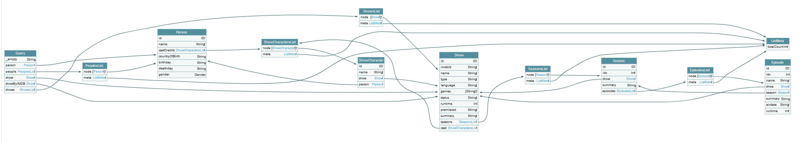

# Fixing n+1 in GraphQL server using DataLoader and SuperTest


GraphQL is known for an amazing client experience. Unfortunately, server side is extremely hard to get right. Things like caching, network request deduplication, batching, n+1, and TypeScript typings are problems most projects will wrestle with. This repository showcases a few architectural patterns to solve these issues.


## Features

* automatically solve `n+1`
* customized `DataLoader` that handles objects as keys
* `personObjectTypeResolver` is the only source of object definition
* strong typings (both custom written and `codegen`)
* tests using supertest


## Writing flexible resolvers

This is how most tutorials tell you to write resolvers:

```
// schema
type Query {
  person(id: ID!): Person!
}

type Person {
  id: ID!
  name: String!
  gender: Gender
}


// query resolver
const personQueryResolver = (root, args, ctx) =>
  ctx.dataSources.peopleAPI.getOne(root.id);
```

Following this code style, you may quickly find that your code has calls to `ctx.dataSources.peopleAPI.getOne` from all different places. It's very hard to reason about the system. Problems like `n+1` are hard to trace. It's not a scalable way of writing GraphQL server.

Instead, you can write explicit connections between resolvers by `id`:

```
// same schema as before

// improved query resolver. It will invoke property resolvers in `personObjectTypeResolver`
const personQueryResolver = (root, args, ctx) => root.id;

// resolver for a single person. Each field defines how to get the value based on `root`.
const personObjectTypeResolver = {
  id: (root) => root,
  name: (root, _args, ctx) =>
    ctx.dataSources.peopleAPI.getOne(root).name,
  gender: (root, _args, ctx) =>
    ctx.dataSources.peopleAPI.getOne(root).gender,
};

```


Main idea is that if the **field** does not appear in the GraphQL query, it's resolver will not be called. Imagine that `personObjectTypeResolver#gender` requires more requests then one to resolve the final value. Or that it is a nested object. By structuring the resolvers like in a 2nd example, we can guarantee that only the absolutely required code paths will be used. You can think of `root` argument as a minimal set of data that can be used to derive rest of fields from.

In the extreme example, if we query a Person by `id` and in response we only want `id`, the system should not do any external API calls. All data needed to resolve the request was provided in the request itself. In this repo there is a separate test case for this. API calls should only be done by resolvers for lists and simple types (strings, numbers, enums etc.).


## Managing external API calls

We can use `DataSources` pattern from Apollo Server with [DataLoader](https://www.npmjs.com/package/dataloader) library to:

* **deduplicate calls** - multiple calls to same endpoint will be grouped into one. E.g. 2 calls to `/person/1` will be executed as a single request
* **batch calls** - calls to same endpoint with diferent parameters can be grouped into one. E.g. calls to `/person/1` and `/person/2` can be executed as `/person?id=1&id=2` if we want
* **cache results** - any subsequent call to `/person/1` will skip the request and use the response received previously.

I recommend [subclassing DataLoader](src\dataSources\MyDataLoader.ts) to provide some QoL improvements. We can use custom `cacheKeyFn` to handle objects as `DataLoader` keys, or have nicer semantic to add objects to cache.


## Summary

All in all, we have a simple architecture with a clear responsibility separation that automatically solves `n+1`. For each field in GraphQL request we have one place that is source of truth - respective resolver funcion. Our external API requests are [easy to trace](src\dataSources\RestResource.ts). And the system is actually quite simple. There are only resolvers and DataSources. Adding new data type requires only 2 new files. Adding new connection requires only field resolver that returns an `id` - rest of the properties will be filled based on this `id`.


If you find my explanation not adequate, take a look at following articles exploring similar problem:

* https://medium.com/paypal-tech/graphql-resolvers-best-practices-cd36fdbcef55
* https://blog.logrocket.com/properly-designed-graphql-resolvers/
* https://shopify.engineering/solving-the-n-1-problem-for-graphql-through-batching


> Other alternative is to use external cache that persists between different requests. This solution can be quite complicated when different users have acccess to different resources. See FAQ below.


## Schema


*GraphQL schema. Generated with [graphql-voyager](https://apis.guru/graphql-voyager/).*


## FAQ


**Q: How to handle create/edit operations?**

If the external API returns an object from create/edit operation, you can manually add it to a `DataLoader` cache (see `MyDataLoader.addToCache`). Subsequent object properties resolver will use cached value instead of making a new request.


**Q: Do I have to deduplicate every request to external service?**

Probably yes. Since doing the same request can be wasteful, it's good to always cache the responses. In GraphQL you do not know which API calls you will need to resolve future nested fields.

For example "people by name" query touches 2 cache maps:

* map of `searchedName` -> `id[]` of matching people
* map of person `id` -> `person details` (name, age, gender etc.)

This means we need 2 separate cache objects/dataloaders.


**Q: What is Dataloader lifecycle?**

In this repo each `Dataloader` is inside Apollo Server's `DataSource` object. `DataSource` object is [recreated for each request](https://www.apollographql.com/docs/apollo-server/data/data-sources/#adding-data-sources-to-apollo-server).


**Q: How can I use objects as keys for DataLoader?**

DataLoader uses `Map` by default. `Map` does not support objects as keys. We want to compare  the values using deep equal instead of reference. Two easy solutions are:

* provide `cacheKeyFn` in options in DataLoader constructor that will automatically convert each key into e.g. string. I've used `objectHash` from `object-hash` that is stable wrt. order of keys in objects. In `MyDataLoader` this `cacheKeyFn` is hardcoded as I don't think there is any downside to this solution.
* provide custom `cacheMap` in options in DataLoader constructor. This is more heavy handed approach, but can be used to have complete control over cache. Simple implementation that handles objects is a list with comparator using [isDeepStrictEqual](https://nodejs.org/api/util.html#util_util_isdeepstrictequal_val1_val2).


In practice, composite keys are usually very simple objects with a few string/number field.


**Q: How to design API that is nice to use from GraphQL server?**

* There should always be one representation for a single concept.
* Always provide a batched GET. There is no reason for endpoints like `/post/1`, when you can `/post?id=1&id=2`. It saves a lot of requests and works well with DataLoader. This rule can be extended to create, update, delete too.
* Be explicit about mandatory/required fields in returned objects. This is especially important with protobuf 3 and it's [default values for fields](https://developers.google.com/protocol-buffers/docs/proto3#default).
* `n+1` is a huge problem due to how resolvers are executed. If some list contains 500 objects, then subsequent resolver could try to send **500 new requests at the same time**. A lot of execution environments will try to limit in-flight request count. Though due to cascading nature of distributed systems, throttling at the level of one service is not enough. It's easier to batch the requests instead.
* You cannot predict which fields are going to be requested. Please ask your GraphQL server engineers to implement [rate limits](https://blog.logrocket.com/securing-graphql-api-using-rate-limits-and-depth-limits/) or they will bring your API down.
* In GraphQL, list data and metadata (cursors, total count) do not have to be retrieved in same request. This topic is actually a bit more complicated. Imagine the GraphQL request that asks for total number of items matching some criteria, but do not want any of these items. In most REST APIs you would model this as a paginated request with `?limit=0`. But there are a lot of REST APIs that return error on `?limit=0`.
* Be careful with error handling. Backend For Frontend introduces another layer of indirection in the system. It's easy to lose error tracking info. One solution is to wrap API caller into wrapper that intercepts response errors, shoves all data into sentry and rethrows error. Then custom Apollo Server Plugin logs the error to Sentry. Sentry's `captureException` returns `eventId` that you can append to GraphQL response so that it is visible in `React` project. This makes it easier to track issues between Sentry projects. It's a poor man's [jaeger](https://www.jaegertracing.io/), but much easier to implement and use.


**Q: What if I use external cache like Redis?**

This repo only show per-request cache. If your cache persists between different requests, the solution presented in this repo is not directly transferable. But you can always reuse some ideas.


**Q: How can I verify that solution in this repo works?**

Use `yarn test`. Here is [example test file](src\resolvers\Show\queries\Show.spec.ts) that asserts:

* Query for `Show` by `id` that returns only `id` should no do any network requests. All needed data is already provided in the query's `args`. This is a test for overfetch.
* Query for all `Show` properties that we can copy from a `https://api.tvmaze.com/shows/118`. This should result in a single network request. We rely here on deduplication.
* Query for `Show` including data about all `Seasons` and `Episodes`. We traverse many different graph connections.

`nock` throws on any unexpected network request. We also use Jest snapshots in assertions.


**Q: How do the tests work in this repo?**

[Supertest](https://www.npmjs.com/package/supertest) spins up the server and sends the HTTP requests against it. All outgoing network requests to external services are mocked. The entire GraphQL response is then Jest snapshoted. This way the request goes through our entire system, from initial GraphQL request to snapshoted HTTP response. It's actually quite cool and with low effort (copy & paste) gives quite a lot of confidence in the system. One downside is that it can be quite slow to execute.


**Q: What are the alternatives to `nock`?**

I've used `nock` since it has nice defaults (like error on any unexpected request). You can also use [miragejs](https://miragejs.com/). Read more in [Stop mocking fetch](https://kentcdodds.com/blog/stop-mocking-fetch) by Kent Dood.


**Q: How does GraphQL work with TypeScript typings?**

Poorly. Typings work well when You have one function directly calling another. GraphQL resolvers are a typical **framework** that calls your code instead. There are no direct connections between resolvers that are in a different files. And since key point of GraphQL are graph connections, You need to manage the types by yourself. This is **VERY** brittle.

`graphql-codegen` is an awesome package to generate typings from `.graphql` schema files. In [codegen.yml](./codegen.yml) I've provided an example configuration. You can see it in action in [Person module](src\resolvers\Person). Unfortunately nullable fields do not work with resolvers returning `undefined`, but otherwise it's a solid option. As an alternative, I've created [some utility types]([src\utils\graphql.ts]) that I found useful, along with [example usage](src\resolvers\Show\types\Show.ts).

Please note that [code first approach](https://blog.logrocket.com/code-first-vs-schema-first-development-graphql/) (using e.g. [type-graphql](https://github.com/MichalLytek/type-graphql)) does not solve this. Code first approach takes care of wiring different parts of the app together, but it's up to You to manually decide what type is returned from the resolver function.


## Usage

**This repo uses [Yarn 2](https://yarnpkg.com/getting-started/install).**

1. `yarn install`
2. `yarn generate:gql-types` <- generate typings from GraphQL schema
3. `yarn start` <- dev server
4. Go to `http://localhost:8080/graphql`

Alternatively, `yarn build` for production build into `dist` folder.

**Other scripts:**

* `yarn generate:gql-types` - generate TS typings from GraphQL schema. Run after each `*.graphql` file change. Aliased as `yarn gen`.
* `yarn prettier`
* `yarn lint`
* `yarn test` - run tests using [supertest](https://www.npmjs.com/package/supertest)
* `yarn test:watch`


## Awesome libs used in this project

* [DataLoader](https://www.npmjs.com/package/dataloader) - with [code walkthrough](https://www.youtube.com/watch?v=OQTnXNCDywA). It has some nifty tricks with event loop, promises and [microtask queue](https://javascript.info/microtask-queue) ([WHATWG spec](https://html.spec.whatwg.org/multipage/webappapis.html#event-loops)).
* [supertest](https://www.npmjs.com/package/supertest) - run the server in test and send the HTTP request agains it. Assert the response (both HTTP status and body).
* [nock](https://www.npmjs.com/package/nock) - `nock.disableNetConnect();` disables all network connections. This includes also our `supertest` server (fixed with `nock.enableNetConnect("127.0.0.1");`).
* [tvmaze](https://www.tvmaze.com/api) as API to work against.